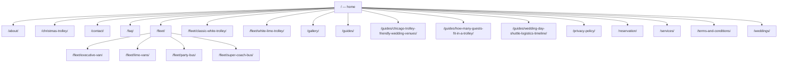

# ChiTown Trolley Internal Link Map

Audit target: `https://chitowntrolley.com/`  
Source: production-domain Astro build and local production preview, August 11, 2026.

## Crawl Summary

| Metric | Result |
|---|---:|
| Generated HTML routes | 23 |
| Indexable routes | 22 |
| Sitemap URLs | 22 |
| Internal anchor occurrences | 778 |
| Indexable orphan pages | 0 |
| Maximum shortest crawl depth | 2 |
| Pages deeper than three clicks | 0 |
| Broken internal destinations | 0 |
| Fragment occurrences / broken fragments | 125 / 0 |
| Internal page links missing the canonical trailing slash | 0 |

`Inlink sources` below counts distinct generated pages that link to the route, not repeated links from the same page. `Out targets` counts distinct destinations present on that page, including same-page fragment/navigation targets.

## Route Tree

```text
/                                      depth 0
├── /about/                            depth 1
├── /christmas-trolley/                depth 1
├── /contact/                          depth 1
├── /faq/                              depth 1
├── /fleet/                            depth 1
│   ├── /fleet/classic-white-trolley/  depth 1 (also linked from home)
│   ├── /fleet/white-limo-trolley/     depth 1 (also linked from home)
│   ├── /fleet/executive-van/          depth 2
│   ├── /fleet/limo-vans/              depth 2
│   ├── /fleet/party-bus/              depth 2
│   └── /fleet/super-coach-bus/        depth 2
├── /gallery/                          depth 1
├── /guides/                           depth 1
│   ├── /guides/chicago-trolley-friendly-wedding-venues/  depth 1
│   ├── /guides/how-many-guests-fit-in-a-trolley/         depth 1
│   └── /guides/wedding-day-shuttle-logistics-timeline/   depth 1
├── /privacy-policy/                   depth 1
├── /reservation/                      depth 1
├── /services/                         depth 1
├── /terms-and-conditions/             depth 1
└── /weddings/                         depth 1

/404.html                              noindex utility; intentionally unlinked
```

## Crawl Depth and Link Counts

| Route | Indexable | Sitemap | Inlink sources | Out targets | Shortest depth |
|---|---:|---:|---:|---:|---:|
| `/` | Yes | Yes | 22 | 18 | 0 |
| `/about/` | Yes | Yes | 22 | 13 | 1 |
| `/christmas-trolley/` | Yes | Yes | 22 | 13 | 1 |
| `/contact/` | Yes | Yes | 22 | 13 | 1 |
| `/faq/` | Yes | Yes | 22 | 13 | 1 |
| `/fleet/` | Yes | Yes | 22 | 19 | 1 |
| `/fleet/classic-white-trolley/` | Yes | Yes | 6 | 14 | 1 |
| `/fleet/white-limo-trolley/` | Yes | Yes | 3 | 14 | 1 |
| `/fleet/executive-van/` | Yes | Yes | 1 | 14 | 2 |
| `/fleet/limo-vans/` | Yes | Yes | 2 | 14 | 2 |
| `/fleet/party-bus/` | Yes | Yes | 1 | 14 | 2 |
| `/fleet/super-coach-bus/` | Yes | Yes | 4 | 14 | 2 |
| `/gallery/` | Yes | Yes | 22 | 13 | 1 |
| `/guides/` | Yes | Yes | 22 | 16 | 1 |
| `/guides/chicago-trolley-friendly-wedding-venues/` | Yes | Yes | 5 | 17 | 1 |
| `/guides/how-many-guests-fit-in-a-trolley/` | Yes | Yes | 5 | 20 | 1 |
| `/guides/wedding-day-shuttle-logistics-timeline/` | Yes | Yes | 5 | 18 | 1 |
| `/reservation/` | Yes | Yes | 22 | 13 | 1 |
| `/services/` | Yes | Yes | 22 | 14 | 1 |
| `/weddings/` | Yes | Yes | 22 | 17 | 1 |
| `/privacy-policy/` | Yes | Yes | 22 | 27 | 1 |
| `/terms-and-conditions/` | Yes | Yes | 22 | 36 | 1 |
| `/404.html` | No | No | 0 | 14 | Unreached utility |

## Shortest-Path Graph

This graph intentionally shows shortest discovery paths rather than repeating every sitewide header/footer edge.



## Findings

- No indexable page is orphaned.
- No route is more than two clicks from the homepage.
- No internal destination, fragment, or referenced asset failed in the production preview crawl.
- Navigation, footer, and mobile navigation expose the same important destinations in server-rendered HTML.
- All internal page links now use the same trailing-slash form as canonicals and sitemap URLs; the prior sitewide redirect hop was removed.
- Quote-selection URLs retain their query string and `#getquote` fragment, canonicalize to the query-free homepage, and match actual vehicle options.
- `/404.html` is a noindex utility page and deliberately has no internal inlink, sitemap entry, or canonical.
